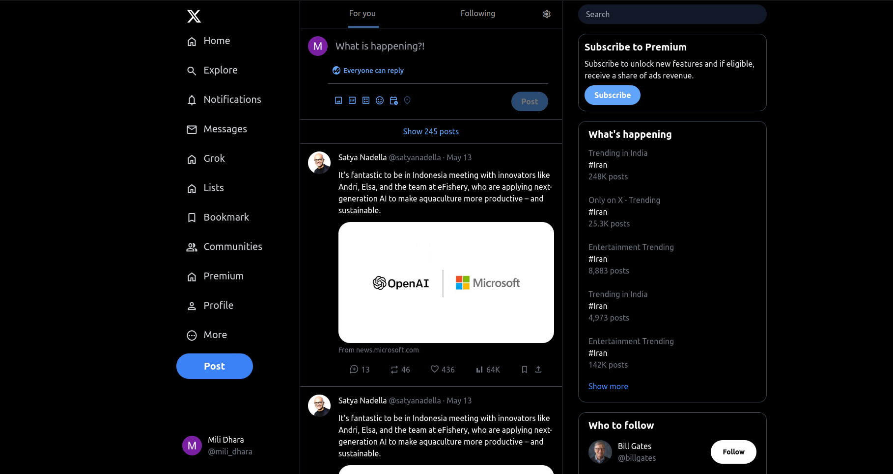

# Twitter Clone

A simple Twitter clone built with HTML and Tailwind CSS.

## Features

- User profile display
- Follow button functionality
- Responsive design
- Interactive UI elements

## Screenshots

## Getting Started

### Prerequisites

- Web browser (Chrome, Firefox, Safari, etc.)

### Built With

- HTML
- Tailwind CSS

### Usage

- Customize the user profile display by editing the index.html file.
- Adjust the styles using Tailwind CSS classes.
  
### Contributing

- Fork the repository
- Create your feature branch (git checkout -b feature/AmazingFeature)
- Commit your changes (git commit -m 'Add some AmazingFeature')
- Push to the branch (git push origin feature/AmazingFeature)
- Open a pull request
  
### License

This project is licensed under the MIT License.

### Contact

Mili Dhara - milidharansde@gmail.com
Project Link: https://github.com/mili-dhara/My-Twitter-Clone.git

